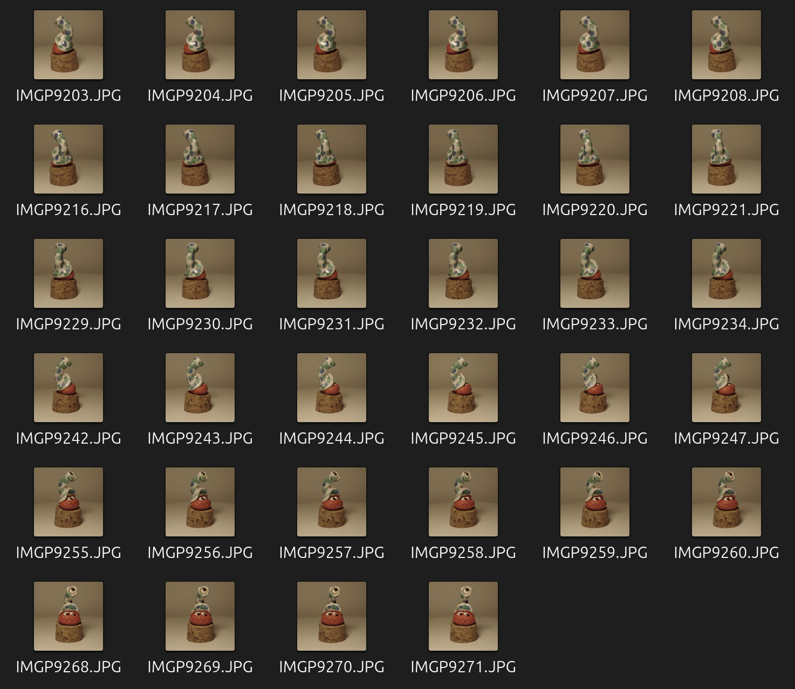
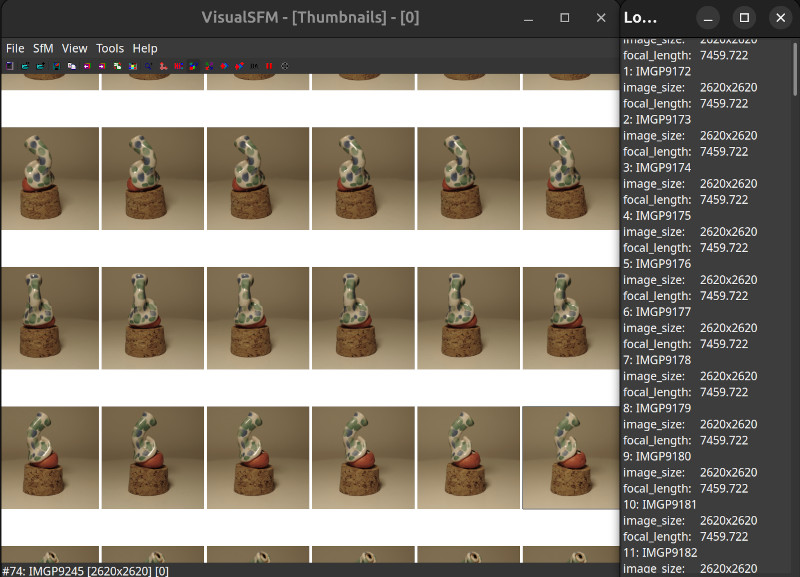
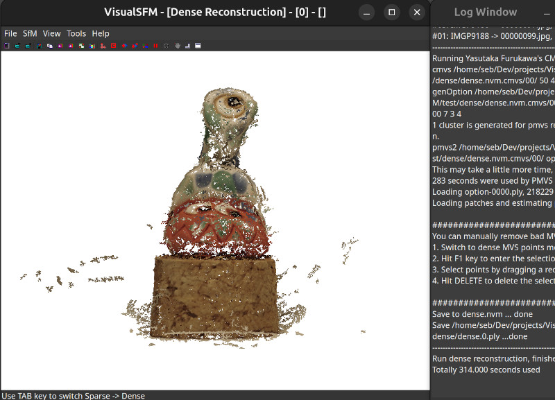

# M5 Photogrammetry Project
_Hardware and Software to do low cost photogrammetry_

## Introduction

Based on the following project [Arduino controlled photogrammetry 3D-scanner](https://www.thingiverse.com/thing:3958326) I decided to replace the arduino by any device I2C compatible. (for the moment M5Stack devices)

Here are the different parts of the project:
- 3D scanner updated to replace the arduino by an electronic card control thanks to I2C with a Grovre connector
- An electronic card to control the 3D-scanner. The card will be control by I2C and will control the stepper motor. The card is also able to control a camera thanks to a micro jack
- M5Stack arduino code to control the electronic card and take photos thanks to mobile phone (thanks to BlueTooth) or Flucard for Pentax (Thanks to Wifi)

# Hardware: 3D Scanner

# Hardware: Electronic card

# Software: Arduino code for M5Stack

# Software: Arduino code for M5StickC
TODO

# Photo shooting

# Photogrammetry Software
Thanks to the previous steps we can have multiple photos of different angles of the object we want to reconstruct. It is now time to reconstruct the 3D Model.

Multiple Photogrammetry are available:
- [VisualSFM](http://ccwu.me/vsfm/)
- [MeshRoom](https://github.com/alicevision/meshroom/)
- [Regard3D](https://sourceforge.net/projects/regard3d/files/Regard3D/)

## VisualSFM
I created an installation script to Install [VisualSFM on Ubuntu 24.04](https://github.com/colas-sebastien/VisualSFM)

# Meshing Software

## MeshLab